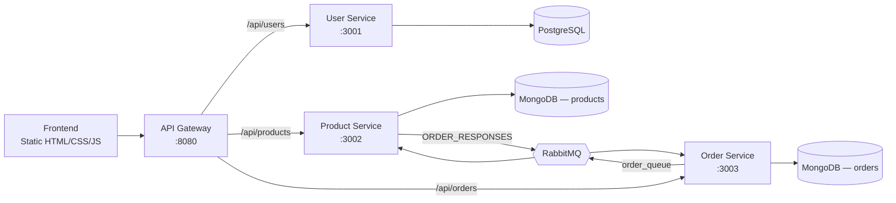

# EShop Microservices

A full-stack e-commerce platform built around a microservices architecture: three independent Node.js/Express services (users, products, orders), each with its own database, fronted by a single API gateway and a vanilla JS/Bootstrap client. Services communicate synchronously through the gateway and asynchronously through RabbitMQ for stock reservation.

## Table of Contents

- [Overview](#overview)
- [Features](#features)
- [Architecture](#architecture)
- [Tech Stack](#tech-stack)
- [Project Structure](#project-structure)
- [Getting Started](#getting-started)
- [API Reference](#api-reference)
- [Testing](#testing)
- [Security Notes](#security-notes)
- [License](#license)

## Overview

EShop is an online store for tech products (laptops, smartphones, and similar devices), including support for products with multiple purchasable options (e.g. different storage sizes or colors, each with its own price and stock). The backend is split into four services that each own a single responsibility and never share a database, communicating either through the API gateway (synchronous, request/response) or through RabbitMQ (asynchronous, for order stock reservation).

## Features

**Customer-facing**
- Registration and login with JWT-based sessions
- Product catalog with search, sorting, and category filtering
- Products with variants (e.g. storage/color) — selecting an option updates price and stock in real time
- Shopping cart and wishlist, both usable as a guest (persisted in `localStorage`) and merged into the account experience once logged in
- Checkout with shipping details and promo codes
- Order history with cancellation (while an order is still pending)
- Order-status and review-reminder notifications
- Product ratings and reviews
- Responsive UI: a standard top navbar on desktop, and a native-app-style bottom tab bar on mobile

**Admin panel**
- Product CRUD, including managing variants and stock per option
- Order management and status updates
- Promo code management

**Engineering highlights**
- Database-per-service: PostgreSQL for users, MongoDB for products, a separate MongoDB instance for orders
- Asynchronous stock reservation over RabbitMQ, decoupling the order and product services
- Centralized JWT verification and role-based authorization (`customer` / `admin`), with the role always resolved server-side rather than trusted from the client
- API gateway as the single public entry point, reverse-proxying and path-rewriting requests to each service
- Each service is independently dockerized, with `docker-compose` orchestrating startup order via healthchecks
- 44 automated tests (Jest + Supertest) across all four services

## Architecture



When an order is placed, `order-service` saves it with status `PENDING` and publishes one message per line item to the `order_queue`. `product-service` consumes each message, checks stock (on the product itself, or on the specific variant if one was ordered), decrements it if available, and replies on the `ORDER_RESPONSES` queue. `order-service` only reacts to failures — a successful reservation leaves the order `PENDING` for an admin to move forward; a failed one flips it to `FAILED`. This keeps the two services decoupled: neither one blocks waiting on a synchronous call to the other.

| Service | Responsibility | Port | Database |
|---|---|---|---|
| API Gateway | Single entry point; proxies `/api/*` to the right service | 8080 | — |
| User Service | Registration, login, JWT issuance | 3001 | PostgreSQL |
| Product Service | Catalog, variants, stock, RabbitMQ consumer | 3002 | MongoDB |
| Order Service | Order creation, history, status, RabbitMQ producer/consumer | 3003 | MongoDB |

## Tech Stack

- **Backend**: Node.js, Express 5, JWT (`jsonwebtoken`), `bcryptjs`
- **Data**: PostgreSQL (`pg`), MongoDB (`mongoose`)
- **Messaging**: RabbitMQ (`amqplib`)
- **Gateway**: `http-proxy-middleware`, `cors`
- **Frontend**: HTML, vanilla JavaScript, Bootstrap 5
- **Testing**: Jest, Supertest, `mongodb-memory-server`
- **Infrastructure**: Docker, Docker Compose

## Project Structure

```
eshop-microservices/
├── api-gateway/        # Reverse proxy, single public entry point
├── user-service/       # Auth: registration, login, JWT issuance (PostgreSQL)
├── product-service/    # Product catalog, variants, stock (MongoDB)
├── order-service/      # Orders, checkout, status (MongoDB)
├── frontend/           # Static HTML/CSS/JS client
└── docker-compose.yml  # Orchestrates all services and databases
```

Each backend service follows the same internal layout: `index.js` (entry point + routes), `middleware/auth.js` (JWT verification and role checks), and `__tests__/` (Jest test suites).

## Getting Started

### Prerequisites

- [Docker](https://www.docker.com/) and Docker Compose
- [Node.js](https://nodejs.org/) 18+ (only needed to serve the frontend locally or to run tests outside Docker)

### 1. Clone and configure

```bash
git clone <this-repository-url>
cd eshop-microservices
cp .env.example .env
```

Open `.env` and fill in real values — at minimum, replace `JWT_SECRET` with a long random string. The other placeholders are fine for local development.

### 2. Start the backend

```bash
docker compose up --build
```

This builds and starts all four services plus PostgreSQL, two MongoDB instances, and RabbitMQ, with healthchecks ensuring each service only starts once its database (and RabbitMQ, where relevant) is ready. The API is then available at `http://localhost:8080`.

The RabbitMQ management UI is available at `http://localhost:15672` (default guest/guest credentials).

### 3. Serve the frontend

The frontend is plain static HTML/CSS/JS with no build step, so any static file server works:

```bash
npx http-server frontend -p 5500
```

Then open `http://localhost:5500/index.html`. It talks to the API at `http://localhost:8080/api` by default (see `API_BASE_URL` in `frontend/app.js`).

### 4. Get an admin account

Register a normal account through the UI using the email set as `ADMIN_EMAIL` in `.env` (defaults to `admin1@eshop.com`). The role is resolved server-side at login by comparing the account's email against `ADMIN_EMAIL` — that account will automatically get the `admin` role and access to `admin.html`.

## API Reference

All routes below are prefixed with `http://localhost:8080/api` through the gateway.

**Users** (`/users`)

| Method | Path | Auth | Description |
|---|---|---|---|
| POST | `/register` | — | Create a new account |
| POST | `/login` | — | Authenticate and receive a JWT |

**Products** (`/products`)

| Method | Path | Auth | Description |
|---|---|---|---|
| GET | `/` | — | List all products |
| POST | `/` | Admin | Create a product (optionally with variants) |
| PUT | `/:id` | Admin | Update a product |
| DELETE | `/:id` | Admin | Delete a product |

**Orders** (`/orders`)

| Method | Path | Auth | Description |
|---|---|---|---|
| POST | `/` | Customer | Place an order |
| GET | `/` | Admin | List all orders |
| GET | `/user/:email` | Owner or Admin | List a specific customer's orders |
| PUT | `/:id/status` | Owner (cancel only, while pending) or Admin (any status) | Update an order's status |

## Testing

Each backend service has its own Jest test suite:

```bash
cd user-service && npm test      # mocked PostgreSQL
cd product-service && npm test   # real MongoDB via mongodb-memory-server
cd order-service && npm test     # real MongoDB via mongodb-memory-server
cd api-gateway && npm test       # proxying against fake HTTP targets
```

Product and order stock/authorization logic is tested against a real, in-memory MongoDB instance rather than mocks, and the stock-reservation logic used by the RabbitMQ consumer is extracted into a plain, independently unit-tested function.

## Security Notes

- Passwords are hashed with `bcryptjs` before being stored; plaintext passwords never touch the database.
- JWTs are verified on every protected route via shared `authenticate`/`requireAdmin` middleware.
- A user's role is always derived server-side (by comparing their email against `ADMIN_EMAIL`) and embedded in the signed JWT — it is never accepted from client-supplied data.
- Ownership checks (e.g. a customer can only view or cancel their own orders) are enforced in the service layer, not just hidden in the UI.

## License

No license has been specified for this project yet.

